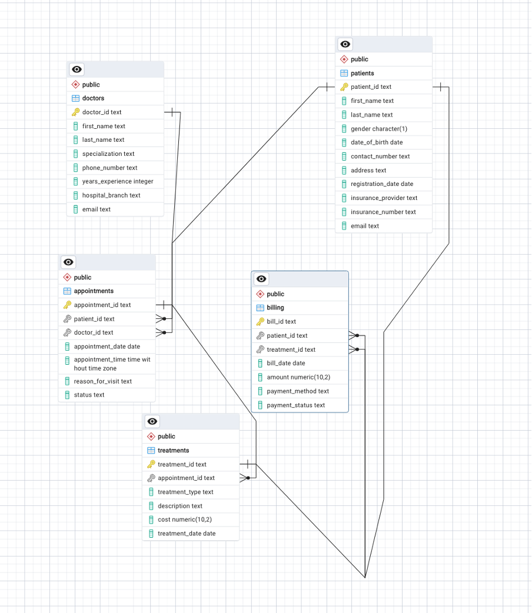

# SAUcare

SAUcare is a regional healthcare provider.  
This repository contains a data analytics project for the hospital management dataset (patients, doctors, appointments, treatments, billing).  

The goal is to perform operational and financial analytics: patient demographics, doctor activity, appointment statistics, treatment costs and billing analytics.

---

## ERD Diagram



---

## Dataset

Files (CSV) used in the project (stored in `archive/`):

- **patients.csv** — patient demographic and registration details  
- **doctors.csv** — doctor metadata  
- **appointments.csv** — scheduled / completed / cancelled appointments  
- **treatments.csv** — treatments performed during appointments  
- **billing.csv** — billing and payment records  

---

## Contents of the repository

- `schema.sql` — CREATE TABLE statements for all tables  
- `queries.sql` — 10 analytical SQL queries (with short comments)  
- `main.py` — Python script to connect to the DB and run sample queries  
- `requirements.txt` — Python dependencies  
- `archive/` — CSV files (not included in repo if large)  
- `images/` — ER diagram

---

## Quick setup & run instructions

### 1. Prerequisites
- macOS / Linux / Windows  
- PostgreSQL 14 (or compatible) installed and running  
- pgAdmin (optional)  
- Python 3.10+  
- Git and optionally the GitHub CLI (`gh`)  

### 2. Create virtual environment and install dependencies
```bash
# in project folder
python3 -m venv venv
source venv/bin/activate    # macOS / Linux
# Windows PowerShell:
.\venv\Scripts\Activate.ps1
pip install -r requirements.txt
```

### 3 . Create PostgreSQL database
createdb hospital_management
Or in psql:
CREATE DATABASE hospital_management;
### 4. Create tables
Run the schema.sql file (contains CREATE TABLE statements):
psql -U postgres -d hospital_management -f schema.sql
### 5. Import CSV data
Recommended: use the client-side \copy (works without server file permissions):
psql -U postgres -d hospital_management
Then in psql shell use file `data.sql`
If columns in CSV contain prefixed IDs like P001, ensure corresponding table columns are TEXT (not integer).
### 6. Run analytical queries
Open queries.sql and run queries in pgAdmin or psql to verify results:
psql -U postgres -d hospital_management -f queries.sql
### 7. Run Python script
main.py connects to the DB, runs a few queries and prints results. Example:
python main.py
Tools & resources
PostgreSQL 14 (server)
pgAdmin (GUI for DB)
Python 3.10+, pip
psycopg2-binary, pandas, sqlalchemy
Apache Superset (optional dashboard)
VS Code / Sublime Text for editing
Kaggle (source data)
Project author: Inkar Usurbayeva


